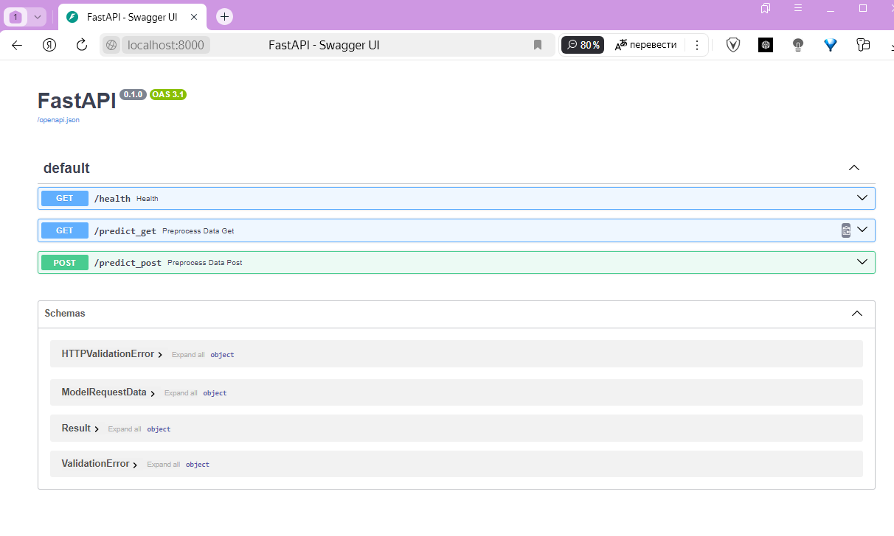
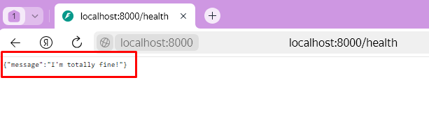
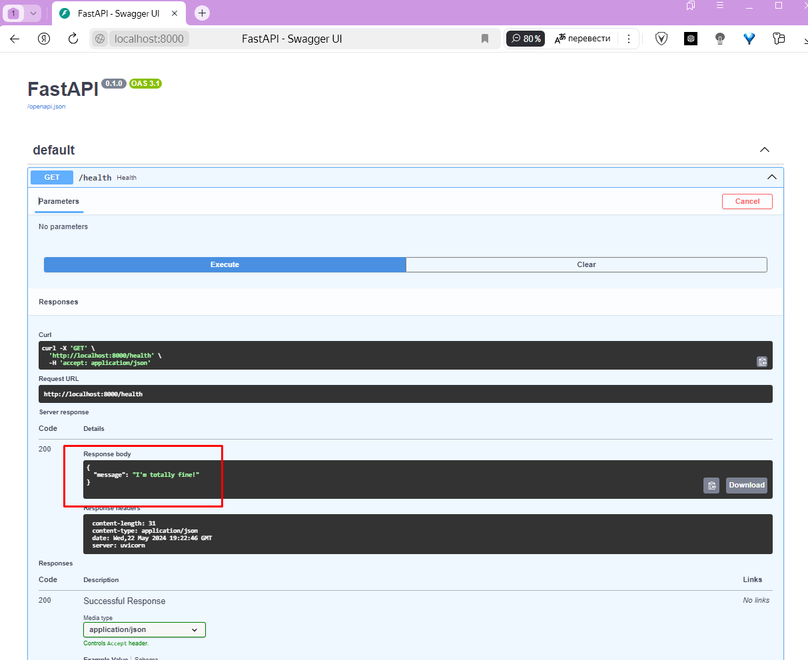
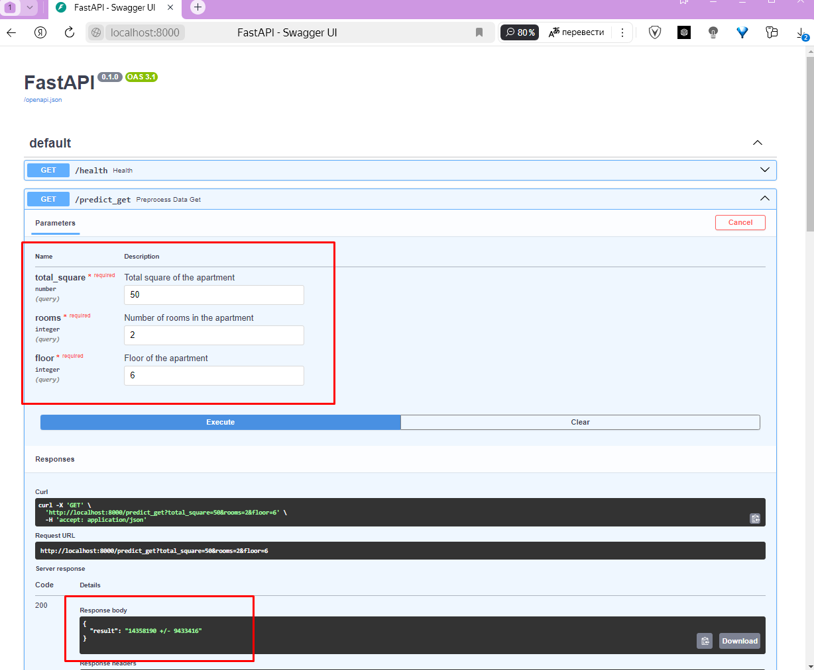
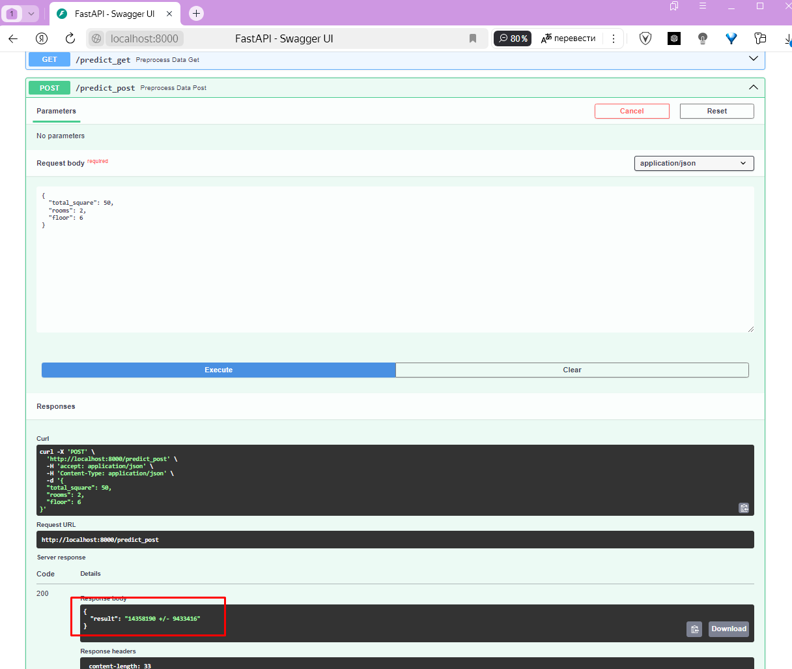

# **Практическое_задание 10**



## **Задание**

В этом задании вам предстоит обучить модель для прогнозирования стоимости недвижимости и создать **API** для модели с помощью **FastAPI**.

Вам нужно:
1. Скачать данные и обучить модель прогнозирования стоимости недвижимости (модель может быть любой сложности, даже линейная регрессия на двух признаках. Можно переиспользовать модель с прошлого ДЗ) - **1 балл**
2. Реализуйте код для получения предсказания обученной моделью - **1 балл**
3. Реализуйте получение предсказания моделью через get-запрос по адресу /predict_get - **2 балла**
4. Реализуйте получение предсказания моделью через post-запрос по адресу /predict_post - **2 балла**
5. Реализуйте liveness-пробу (health-check) health - 1 балл
6. Запустите API через uvicorn, посетите адрес http://127.0.0.1:8000/docs и попробуйте отправить get/post запросы к вашему API через интерфейс Swagger-документации. Результаты выполнения запросов сохраните в виде скриншотов в репозитории - **3 балла**

## **Предобработка данных** 

- Предобработка данных пододно Практическому заданию 9

- Начальный датасет **realty_data.csv** доступен по [ссылке](https://drive.google.com/file/d/1hSM_MCOcJECNpi86XPNgBFw9n8_FHG7p/view?usp=sharing)

    - Нужно скачать и поместить в папку **'data/realty_data.csv'** 
    - Или воспользоваться уже готовой таблицей Pandas в той же папке **/data/data.csv**

### Предобработка данных представлена в [ноутбуке](https://colab.research.google.com/drive/1Dq1qOOzHh7iTcNgXkwxC16Pr8PJWSvWF?usp=sharing)

- Вывод уникальных значений в столбцах
- Удаление лишних столбцов
- Преобразование в численное значение

Предобработанный датасен находит в папке **/data/data.csv**

## **Обучение модели**

Обучение модели в этом задании производилось с помощью линейной регрессии - **LinearRegression**

### **linear_model.pkl** - файл с обученной моделью

### Так же можно самостоятельно запустить обучение модели, если данный файл отсутствует. 

- Предсказание целевых данных цены - столбец **'price'**


## **Как запустить проект**

### Для запуска демо на FastAPI установите зависимости:
```pip install -r requirements.txt```

### Выполнить в корне проекта команду:
```python main.py```


## Отображение работы программы

Перейти в браузере по ссылке: http://localhost:8000/

### Работа **health-check**

- Перейти в браузере по ссылке: http://localhost:8000/health
- Будет отображена надпись - {"message":"I'm totally fine!"}
- Вернется код: 200




## **FastAPI**

### GET/health





- Возращается Code 200
- В поле Response body

```
{
  "message": "I'm totally fine!"
}
```

### GET/predict_get




Выбор параметров производится путем заполнения соответствующих ячеек:

- total_square (общая площадь) **float**
- rooms (количество комнат) **int**
- floor (этаж) **int**

После выбора параметров выводится сумма недвижимости c учетом +/- mae

### GET/predict_post



Выбор параметров производится путем заполнения **Request body** в формате json:

- total_square (общая площадь) **float**
- rooms (количество комнат) **int**
- floor (этаж) **int**

После выбора параметров выводится сумма недвижимости c учетом +/- mae