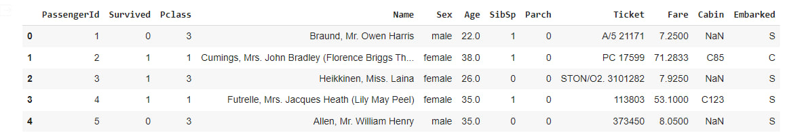

# Практическое задание #3

## Задание:
1. Считайте датасет из файла **train.csv** (это данные о выживаемости на Титанике) - **1 балл**
2. Выведите основную информацию о датасете: информацию о типах данных, число пропусков, средние значения и т.д. - **1 балл**
3. Посчитайте процент выживаемости у каждого класса пассажиров (Pclass) - **1 балл**
4. Выведите самое популярное мужское и самое популярное женское имя на корабле - **1 балл**
5. Выведите самое популярное мужское и самое популярное женское имя на корабле в каждом классе - **2 балла**
6. Выведите часть таблицы с пассажирами, возраст которых больше 44 лет - **1 балл**
7. Выведите часть таблицы с пассажирами, возраст которых меньше 44 лет и которые мужского пола - **2 балла**
8.Выведите количества n-местных кабин (в которых было 2, 3, 4, ... человека) -**1 балл**

## Пример таблицы **train.csv**, первые 5 строк:

