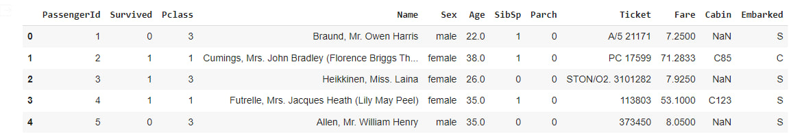
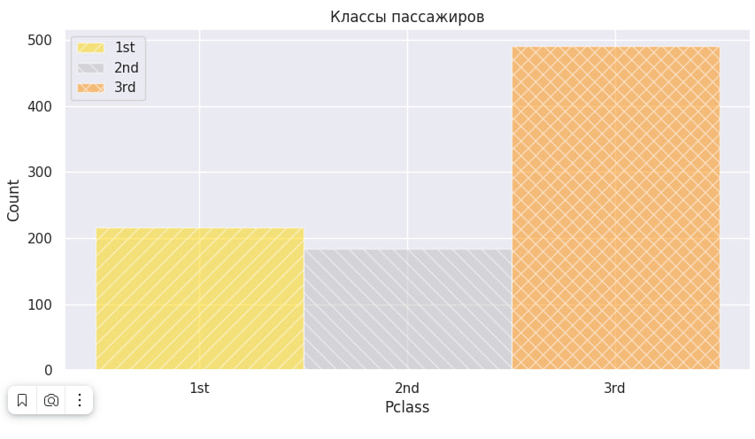
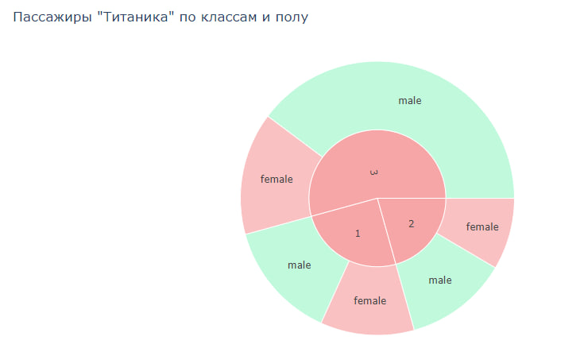

# Практическое задание #4

## Задание:
1. Считайте датасет из файла train.csv (это данные о выживаемости на Титанике) - **1 балл**
2. Визуализируйте распределение значений признаков Survived, Pclass, Age, Sex. Parch - **2 балла**
3. Постройте график типа **boxplot** для столбца Age - **1 балл**
4. Проинтепретируйте полученный график - **1 балл**
5. Постройте график типа **pie chart** для переменных Survived, Pclass, подпишите доли в процентах - **1 балл**
6. Постройте график типа **pairplot** для всех числовых переменных датасета - **1 балл**
7. Постройте интерактивный **sunburst plot** (визуализация иерархических данных) с помощью **plotly**. На первом уровне иерархии - количество пассажиров в каждом из классов, а на втором количество женщин/мужчин в этом классе - **2 балла**
8. Снабдите все построенные графики наименованиями (title), подписями осей, легендами - **1 балл**

## Пример таблицы **train.csv**, первые 5 строк:

## Примеры графиков **Pclass**:

