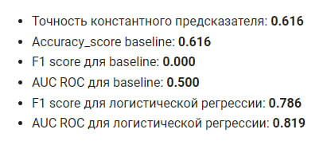

# Практическое задание #6

# **Задание:**

1. Считайте датасет из файла train.csv (это данные о выживаемости на Титанике)
2. Выберите и обоснуйте метрику для измерения качества (accuracy/precision/recall/f1-score/fbeta-score/roc-auc и т.д.). В рамках данного пункта необходимо подобрать наиболее релевантную метрику или набор метрик для вашей задачи, написав краткое обоснование (1-2 предложения) - **2 балла**
3. Постройте бейзлайн и ML-модель классификации (LogisticRegression или любая другая, которая вам кажется подходящей) и оцените их качество с помощью выбранной метрики.

# **Критерии оценки:**
1. Произведено разбиение датасета на тренировочную/тестовую выборки - **1 балл**
2. Произведено измерение качества константного предсказания (например, наиболее частотный класс/случайное предсказание) - **1 балл**
3. ML-модель обучена на тренировочной выборке, учтены особенности предобработки данных для модели, если они есть - **3 балла**
4. Произведено измерение качества на отложенной выборке с использованием ранее выбранной метрики - **1 балл**
5. Обеспечена воспроизводимость решения: зафиксированы random_state, ноутбук воспроизводится от начала до конца без ошибок - **2 балла**

# Корреляция

# Метрики

