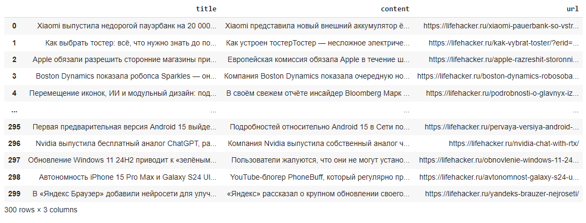

# **Практическое задание #7**

В этом задании вам предстоит собрать данные с сайта **lifehacker.ru** из рубрики Технологии с помощью библиотек **requests** и **BeautifulSoup**.
В частности, нужно собрать заголовки и тексты материалов с первых десяти страниц рубрики.

Примерный пайплайн решения задания аналогичен примеру из itmo_course_python_07_scraping_bs4.ipynb:

1. Определить формат ссылки для пагинации - **1 балл**
2. В разметке страницы найти уникальные классы/идентификаторы блока с названием и содержанием материала- **3 балла**
3. Получить содержимое десяти страниц списка материалов, выделить из него ссылки на каждый материал - **2 балла**
4. Перебрать все полученные ссылки и получить html-код каждого материала - **1 балл**
5. Распарсить полученный текст разметки с помощью BeautifulSoup, вытащив по каждой ссылке заголовок и содержание материала - **2 балл**
6. Создать датайфрейм с полученными данными - **1 балл**

# Pandas таблица

