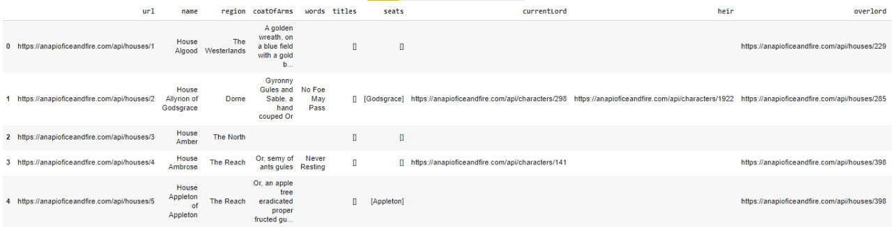

# **Практическое задание #8**

# **Работа с API**
1. Изучить документацию [API OF ICE AND FIRE](https://anapioficeandfire.com/Documentation)
2. Получить информацию обо всех книгах и сохранить в pd.DataFrame - **1 балл**
  - hint: используйте метод requests.get()


3. Получить информацию обо всех домах Вестероса (Houses) и сохранить в pd.DataFrame - **1 балл**
  - hint: используйте метод requests.get()



4. Получить информацию обо всех домах Вестероса, у которых есть девиз, и сохранить в pd.DataFrame - **2 балла**
  - hint: используйте метод requests.get(), используйте в ссылке запроса параметр hasTitles для фильтрации


# **Работа с БД**
1. Установить библиотеку psycopg2 (pip install psycopg2-binary)

```
!pip install psycopg2-binary
```
  - Подключиться к [БД](https://rnacentral.org/help/public-database) - **1 балл**
  - hint: используйте для подключения параметры Hostname, Database, User, Password, указанные на странице БД, и метод psycopg2.connect()
2. Получите 10 строк из таблицы rnc_database - **2 балла**
  - hint: используйте методы conn.cursor(), cursor.execute(), cursor.fetchall(). В SQL-запросе не забудьте использовать LIMIT 10

  

3. Сохраните полученные данные в pd.DataFrame - **1 балл**

  

4. Получите значения столбцов display_name, num_sequences, num_organisms, url для 10 строк из таблицы rnc_database - **2 балла**
  - hint: используйте методы conn.cursor(), cursor.execute(), cursor.fetchall(). В SQL-запросе не забудьте использовать LIMIT 10 и указать нужные вам столбцы

    